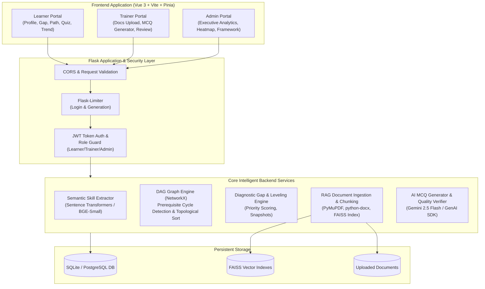

# Karmayogi AI-Enabled Competency Gap & Learning Platform

[](https://www.python.org/downloads/)
[](https://vuejs.org/)
[](https://vitejs.dev/)
[](https://flask.palletsprojects.com/)
[](LICENSE)

An intelligent competency management, diagnostic assessment, and targeted learning system designed for the **Ministry of Statistics and Programme Implementation (MoSPI)** under Mission Karmayogi (SIH26101).

The platform continuously diagnoses skill deficiencies across statistical cadres, constructs prerequisite-aware topological curricula, synthesizes verified multiple-choice questions from uploaded official documentation, and provides executive leaders with an interactive real-time competency heatmap.

---

## 🏛️ System Architecture



---

## 🌟 Key Features

1. **Semantic Profile Extraction**:
   - Parses unstructured officer resumes, bio summaries, and certificates.
   - Computes cosine similarity against official competency descriptors using `BAAI/bge-small-en-v1.5`.
   - Estimates proficiency levels ($L1$ to $L4$) with transparent sentence evidence and reasoning.

2. **DAG Prerequisite Modeling & Topological Curriculum**:
   - Models learning dependencies as a Directed Acyclic Graph (DAG) using `NetworkX`.
   - Rejects circular dependency configurations at schema-level (`CycleDetectedError`).
   - Produces customized learning paths prioritizing missing prerequisites before advanced courses.

3. **RAG-Powered MCQ Synthesis & Quality Filter**:
   - Ingests PDF, DOCX, and TXT training documents (up to 10 MB).
   - Chunks text into overlapping 800-character segments respecting sentence boundaries.
   - Generates multiple-choice questions grounded in specific chunks using Google Gemini.
   - Dual-pass verification checks: rejects hallucinated options, length disparities, and near-duplicates.

4. **Human-in-the-Loop Trainer Review**:
   - Editable question cards with cited source document passage verification.
   - Individual Save, Approve, Reject buttons plus bulk 1-click approval.

5. **Diagnostic Assessments & Adaptive Scoring**:
   - Serves balanced test sessions without leaking answer keys.
   - Dynamic competency level updates with single-session drop caps and historical trend logging.

6. **Executive Intelligence & Real-Time Heatmap**:
   - Cross-organizational macro KPIs: Total learners, average cadre readiness %, quiz completion rates.
   - Top 5 competency deficit chart isolating institutional bottlenecks.
   - Color-coded learner-by-competency matrix ($L0$ through $L5$) with cadre filtering.

---

## 🛠️ Environment Configuration (.env)

The application reads configuration from `.env` in the root directory:

| Variable | Default Value | Description |
|---|---|---|
| `FLASK_APP` | `backend.wsgi:app` | WSGI application entrypoint |
| `FLASK_ENV` | `development` | Environment mode (`development`, `testing`, `production`) |
| `SECRET_KEY` | `dev-secret-key-fallback-12345` | Flask session secret key |
| `JWT_SECRET_KEY` | `dev-jwt-secret-key-fallback-67890` | Secret key used to sign and verify JWT tokens |
| `JWT_EXPIRATION_SECONDS` | `86400` (24 hours) | Token lifespan |
| `DATABASE_URL` | `sqlite:///instance/competency_platform.db` | SQLAlchemy database connection URI |
| `CORS_ORIGINS` | `http://localhost:5173,http://127.0.0.1:5173` | Allowed client origins |
| `GEMINI_API_KEY` | *(Optional)* | Google GenAI API key for live AI MCQ generation |
| `GEMINI_MODEL` | `gemini-2.5-flash` | Gemini model name |
| `RATELIMIT_DEFAULT` | `200 per day;50 per hour` | Base API rate limit |

> [!NOTE]
> The platform is equipped with offline fallbacks and 36 pre-seeded verified questions across three core statistical documents. A Gemini API key is **not required** to demo the platform offline!

---

## 🚀 Quickstart Guide

### 1. Prerequisites
- **Python**: 3.10+ (tested on Python 3.13)
- **Node.js**: v18+ (tested on Node v24)
- **Git**

### 2. Backend Installation & Startup
```bash
# Clone the repository
git clone https://github.com/aditipurohit2605/AI-Enabled-Competency-Gap-Learning-Platform.git
cd "AI-Enabled Competency Gap & Learning Platform"

# Install backend dependencies
pip install -r backend/requirements.txt

# Seed the complete offline demo dataset (25 learners, 4 roles, 3 documents, 36 MCQs)
python backend/seed_demo.py

# Launch Flask backend server
python -m backend.wsgi
```
*Backend API will run at `http://127.0.0.1:5000`.*

### 3. Frontend Installation & Startup
In a separate terminal window:
```bash
cd frontend

# Install frontend dependencies
npm install

# Start Vite dev server
npm run dev
```
*Frontend application will open at `http://localhost:5173`.*

---

## 🔑 Demo Access Credentials

| Role | Email | Password | Access Capabilities |
|---|---|---|---|
| **Administrator** | `admin@example.com` | `admin123` | Executive Heatmap, Top Deficits Chart, Framework Manager, User Directory |
| **Trainer** | `trainer@example.com` | `trainer123` | Document Upload, Chunking & FAISS Indexing, MCQ Generator, Question Review |
| **Primary Learner** | `learner1@example.com` | `learner123` | Dashboard, Profile Bio Extraction, Gap Analysis, Learning Path, Assessments |
| **Demo Learners** | `aarav.sharma@mospi.gov.in`<br>`priya.patel@mospi.gov.in` | `demo123` | 25 pre-populated officers with 8-week historical evaluation curves |

---

## 🧪 Testing & Quality Assurance

### Run Backend Test Suite
```bash
# Run all unit, integration, and end-to-end tests
python -m pytest

# Run tests with code coverage report
python -m pytest --cov=backend/app --cov=backend/services
```

### Run Frontend Lint & Build
```bash
cd frontend

# Run ESLint validation
npm run lint

# Compile production bundle
npm run build
```

---

## 📖 Documentation Index

- **[docs/API.md](docs/API.md)**: Full REST API specification with endpoint routes, HTTP verbs, payload parameters, and response schemas.
- **[docs/DEMO_SCRIPT.md](docs/DEMO_SCRIPT.md)**: Structured 5-minute walkthrough script with screen-by-screen actions and talking points.

---

## ⚠️ Known Limitations & Assumptions

1. **Vector Storage**:
   - Uses local CPU-based FAISS indexes stored under `backend/data/indexes/`. For massive enterprise deployments with millions of vectors, a distributed vector database (e.g. pgvector or Milvus) is recommended.
2. **Offline Mode**:
   - When `GEMINI_API_KEY` is omitted, the live question generator surfaces a friendly notice. Pre-seeded questions ensure offline assessment functionality remains fully intact.
3. **Authentication**:
   - Uses stateless HS256 JWT tokens stored in browser localStorage. Production deployments should implement secure HTTP-only cookies and token rotation.
